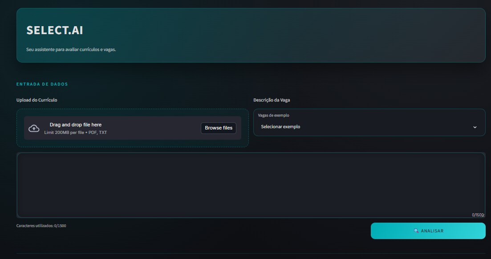
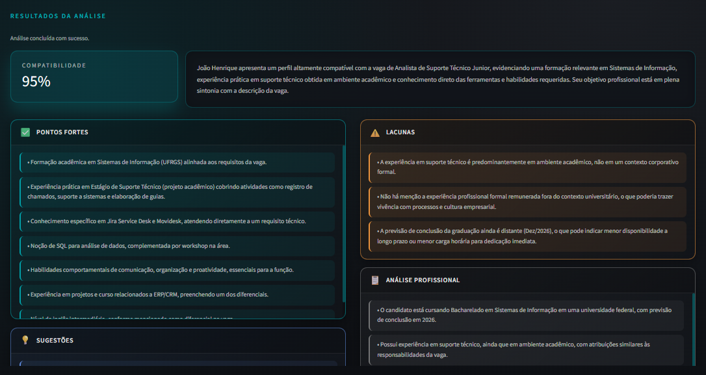

# Select.ai

**O talento certo, na vaga certa!**


---

## 🏆 Projeto Laureado na XIX Mostra de Iniciação Científica do Cesuca!

Este projeto foi **reconhecido e premiado** por sua inovação e aplicabilidade prática no campo de Recursos Humanos e Inteligência Artificial. O Select.ai destaca-se por democratizar tecnologias de IA avançadas, tornando-as acessíveis a empresas de todos os portes.

---

## 🚀 Em Ação

### 📋 Tela de Entrada

Interface intuitiva para upload de currículos e descrição de vagas, com exemplos pré-configurados para teste rápido.



### 📊 Tela de Análise

Resultados detalhados com pontuação de compatibilidade, pontos fortes, lacunas identificadas e recomendações profissionais.



---

## 📖 Descrição

O **Select.ai** é uma aplicação web que automatiza e otimiza o processo de análise de compatibilidade entre currículos e descrições de vagas, utilizando o poder da Inteligência Artificial do **Google Gemini**.

### 🎯 Público-Alvo

Desenvolvido especialmente para **Pequenas e Médias Empresas (PMEs)** que não possuem orçamento para sistemas corporativos de RH caros e complexos. O Select.ai democratiza o acesso a tecnologias de ponta, oferecendo uma solução eficiente, gratuita e de fácil implementação.

### 💡 Desafio Técnico

O projeto foi desenvolvido **100% em Python** como desafio da disciplina de **Programação Orientada a Objetos (POO)**, demonstrando a aplicação prática de conceitos avançados de engenharia de software. Utiliza **Streamlit** para criar uma interface web moderna e responsiva, enquanto o **Google Gemini** fornece capacidades de análise de linguagem natural de última geração.

A solução entrega:

- ✅ **Pontuação de compatibilidade** (0-100) baseada em análise semântica
- ✅ **Identificação de pontos fortes** do candidato em relação à vaga
- ✅ **Mapeamento de lacunas** no perfil profissional
- ✅ **Recomendações personalizadas** para desenvolvimento de carreira
- ✅ **Análise profissional neutra** e livre de vieses

---

## ✨ Funcionalidades

- 🤖 **Análise automatizada** de compatibilidade currículo-vaga usando IA
- 📄 **Suporte para múltiplos formatos**: PDF e TXT
- 📝 **Entrada flexível**: upload de arquivo ou digitação direta da descrição de vaga
- 📊 **Métricas detalhadas**: pontuação, pontos fortes, lacunas e sugestões
- 🎨 **Interface moderna**: tema escuro com design glassmorphism
- ⚡ **Feedback em tempo real**: progresso visual do processamento em etapas
- 🔒 **Privacidade garantida**: processamento stateless, sem armazenamento de dados

---

## 🛠️ Tecnologias Utilizadas

| Tecnologia                              | Finalidade                                      |
| --------------------------------------- | ----------------------------------------------- |
| **Python 3.10+**                  | Linguagem principal                             |
| **Streamlit**                     | Framework para interface web interativa         |
| **Google Generative AI (Gemini)** | Modelo de IA para análise de linguagem natural |
| **PyPDF2**                        | Extração de texto de arquivos PDF             |
| **python-dotenv**                 | Gerenciamento seguro de variáveis de ambiente  |

---

## 📦 Instalação

### Pré-requisitos

- Python 3.10 ou superior
- Chave de API do Google Gemini ([Obtenha aqui](https://makersuite.google.com/app/apikey))

### Passo a Passo

1. **Clone o repositório**

```bash
git clone https://github.com/melloxyz/select-ai.git
cd select-ai
```

2. **Instale as dependências**

```bash
pip install -r requirements.txt
```

3. **Configure as variáveis de ambiente**

```bash
cp .env.exemplo .env
```

Edite o arquivo `.env` e adicione sua chave de API:

```env
GEMINI_API_KEY=sua_chave_aqui
```

4. **Execute a aplicação**

```bash
streamlit run main.py
```

5. **Acesse no navegador**

Abra seu navegador em: `http://localhost:8501`

---

## 🎮 Uso

1. **Upload do Currículo**: Faça upload de um arquivo PDF ou TXT contendo o currículo
2. **Descrição da Vaga**: Digite ou cole a descrição da vaga, ou escolha um exemplo pré-configurado
3. **Análise**: Clique em "🔍 Analisar" e aguarde o processamento
4. **Resultados**: Visualize a pontuação de compatibilidade e análise detalhada

---

## 📁 Estrutura do Projeto

```
select-ai/
├── src/
│   ├── core/
│   │   ├── agente.py            # Integração com Google Gemini
│   │   └── arquivo.py           # Manipulação e normalização de arquivos
│   └── ui/
│       ├── app_streamlit.py     # Interface Streamlit
│       └── styles.css           # Estilos customizados (tema escuro)
├── docs/
│   ├── relatorio_tecnico.txt    # Documentação técnica completa
│   └── requisitos_e_regras_negocio.txt  # Requisitos e regras de negócio
├── assets/                      # Screenshots e recursos visuais
├── main.py                      # Ponto de entrada da aplicação
├── requirements.txt             # Dependências do projeto
├── .env.exemplo                 # Template de configuração
└── LICENSE                      # Licença MIT
```

---

## ⚙️ Configuração Avançada

### Alterando o Modelo de IA

O modelo padrão utilizado é `gemini-2.5-flash`. Para utilizar outro modelo Gemini, adicione a variável `GEMINI_MODEL` no arquivo `.env`:

```env
GEMINI_API_KEY=sua_chave_aqui
GEMINI_MODEL=gemini-pro
```

**Modelos suportados**: Apenas modelos da família Google Gemini

---

## 🏗️ Arquitetura

O Select.ai segue uma **arquitetura em camadas** com separação clara de responsabilidades:

- **Core (Núcleo)**: Lógica de negócio, integração com IA e processamento de arquivos
- **UI (Interface)**: Apresentação, interação com usuário e renderização de resultados
- **Main (Orquestração)**: Ponto de entrada e inicialização da aplicação

### Fluxo de Dados

```
Usuário → Upload/Input → Normalização → Prompt Estruturado → 
Gemini AI → Validação JSON → Renderização → Resultados Visuais
```

Para detalhes técnicos aprofundados, consulte:

- [Relatório Técnico](docs/relatorio_tecnico.txt)
- [Requisitos e Regras de Negócio](docs/requisitos_e_regras_negocio.txt)
- [Instruções para AI Agents](.github/copilot-instructions.md)

---

## 🤝 Contribuição

Contribuições são muito bem-vindas! Para contribuir:

1. 🍴 Faça um fork do projeto
2. 🌿 Crie uma branch para sua feature (`git checkout -b feature/MinhaFeature`)
3. ✅ Commit suas mudanças (`git commit -m 'Adiciona MinhaFeature'`)
4. 📤 Push para a branch (`git push origin feature/MinhaFeature`)
5. 🔃 Abra um Pull Request

**Importante**: Para mudanças significativas, abra uma issue primeiro para discutir o que você gostaria de modificar.

---

## 📄 Licença

Este projeto está licenciado sob a **Licença MIT** - veja o arquivo [LICENSE](LICENSE) para mais detalhes.

---
